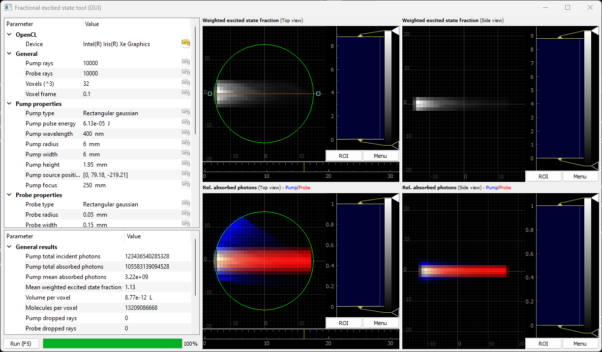

# Pump-probe: Obtain excited state fraction via raytracing 


# Installation
1) Download and install Anaconda 3 (https://www.anaconda.com/download/) for Python 3.6
2) (Optional) Make a new enviroment for FES code
3) Install required packages: "pyopencl" and "pyqtgraph"
```
conda install -c conda-forge pyopencl 
```
and
```
conda install -c anaconda pyqtgraph
```

# Use
1) (Optional) Activate the FES enviroment you made earlier
2) Run 
```
python fest.py [statefile.txt]
```


